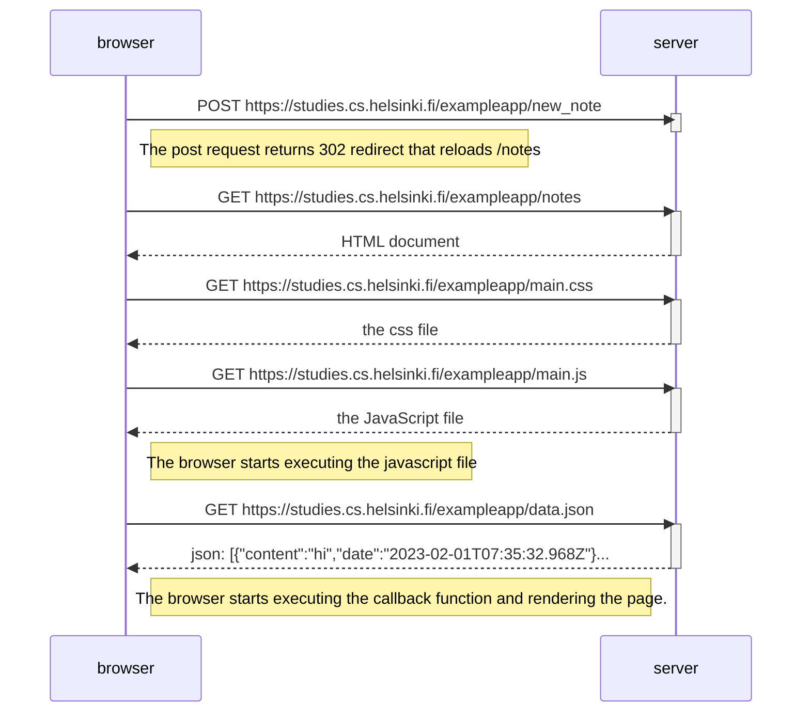

```mermaid

sequenceDiagram
    participant browser
    participant server
    
    browser->>server: POST https://studies.cs.helsinki.fi/exampleapp/new_note
    activate server
    deactivate server

    Note right of browser: The post request returns 302 redirect that reloads /notes
    
    browser->>server: GET https://studies.cs.helsinki.fi/exampleapp/notes
    activate server
    server-->>browser: HTML document
    deactivate server
    
    browser->>server: GET https://studies.cs.helsinki.fi/exampleapp/main.css
    activate server
    server-->>browser: the css file
    deactivate server
    
    
    browser->>server:  GET https://studies.cs.helsinki.fi/exampleapp/main.js
    activate server
    server-->>browser:  the JavaScript file
    deactivate server 
       
    Note right of browser: The browser starts executing the javascript file 

    
    browser->>server:  GET https://studies.cs.helsinki.fi/exampleapp/data.json
    activate server
    server-->>browser:  json: [{"content":"hi","date":"2023-02-01T07:35:32.968Z"}...
    deactivate server   
    
    Note right of browser: The browser starts executing the callback function and rendering the page. 


```
